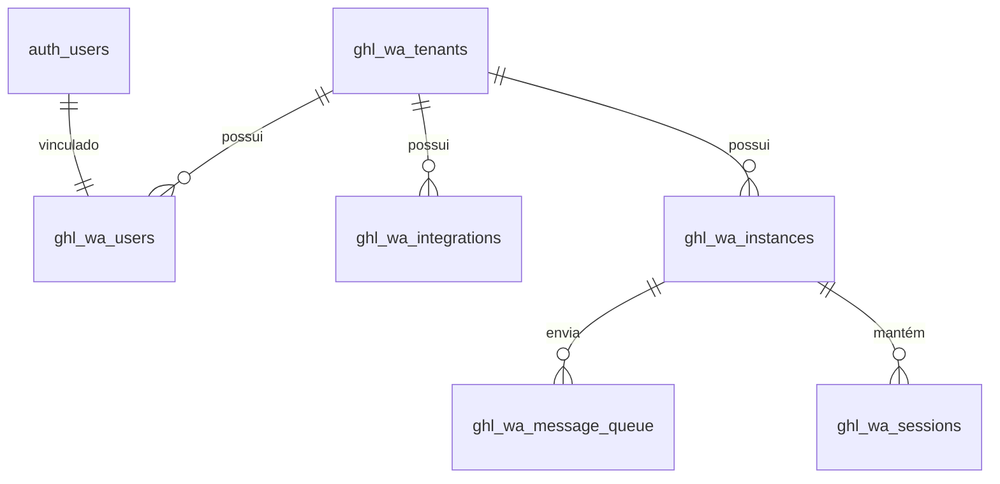

# 📚 Documentação do Esquema de Banco de Dados (Supabase)

Este documento descreve a estrutura do banco de dados PostgreSQL hospedado no Supabase para o projeto **GHL WhatsApp Gateway**.

O esquema utiliza o prefixo **`ghl_wa_`** para todas as tabelas, garantindo isolamento e organização.

---

## 🗺️ Visão Geral e Relacionamentos

O sistema é projetado com **Multi-tenancy** (múltiplos clientes/empresas) como núcleo.

- **Tenants (`ghl_wa_tenants`)**: Representam as contas das empresas.
- **Users (`ghl_wa_users`)**: Usuários vinculados a um Tenant e ao Supabase Auth.
- **Integrations (`ghl_wa_integrations`)**: Conexões OAuth com o GoHighLevel.
- **Instances**: Instâncias do WhatsApp (Baileys) vinculadas a Tenants.
- **Message Queue (`ghl_wa_message_queue`)**: Fila centralizada de mensagens.

### Diagrama Simplificado (Mermaid)

---

## 🗄️ Tabelas Principais

### 1. `ghl_wa_tenants` (Tenants / Empresas)
Armazena as contas dos clientes que utilizam o gateway.

| Coluna | Tipo | Descrição |
| :--- | :--- | :--- |
| `id` | UUID (PK) | Identificador único do tenant. |
| `name` | TEXT | Nome da empresa/cliente. |
| `slug` | TEXT (Unique) | Identificador amigável para URLs. |
| `subscription_status` | TEXT | Status da assinatura (`trial`, `active`, `past_due`, `canceled`). |
| `subscription_plan` | TEXT | Plano contratado (`starter`, `professional`, `enterprise`). |
| `max_instances` | INTEGER | Limite máximo de instâncias de WhatsApp permitidas. |
| `trial_ends_at` | TIMESTAMPTZ | Data de término do período de teste. |
| `webhook_url` | TEXT | URL para envio de eventos (mensagens recebidas, status). |
| `webhook_secret` | TEXT | Segredo para assinar payloads de webhook. |
| `created_at` | TIMESTAMPTZ | Data de criação. |
| `updated_at` | TIMESTAMPTZ | Data da última atualização. |

### 2. `ghl_wa_users` (Usuários)
Vincula os usuários autenticados (Supabase Auth) aos seus respectivos Tenants.

| Coluna | Tipo | Descrição |
| :--- | :--- | :--- |
| `id` | UUID (PK) | ID do usuário (mesmo do `auth.users`). |
| `tenant_id` | UUID (FK) | Referência à tabela `ghl_wa_tenants`. |
| `email` | TEXT | Email do usuário. |
| `role` | TEXT | Papel do usuário (`owner`, `admin`, `member`). |
| `created_at` | TIMESTAMPTZ | Data de criação. |
| `updated_at` | TIMESTAMPTZ | Data da última atualização. |

### 3. `ghl_wa_integrations` (Integrações GHL)
Armazena os tokens de acesso OAuth para a integração com o GoHighLevel.

| Coluna | Tipo | Descrição |
| :--- | :--- | :--- |
| `id` | UUID (PK) | Identificador único da integração. |
| `tenant_id` | UUID (FK) | Referência ao Tenant. |
| `location_id` | TEXT | ID da localização (sub-conta) no GoHighLevel. |
| `access_token` | TEXT | Token de acesso OAuth. |
| `refresh_token` | TEXT | Token para renovação. |
| `token_expires_at` | TIMESTAMPTZ | Data de expiração do token de acesso. |
| `scope` | TEXT | Escopos de permissão concedidos. |
| `user_type` | TEXT | Tipo de usuário que autorizou (`Location` ou `Agency`). |
| `company_id` | TEXT | ID da agência (se aplicável). |
| `created_at` | TIMESTAMPTZ | Data de criação. |
| `updated_at` | TIMESTAMPTZ | Data da última atualização. |

### 4. `ghl_wa_message_queue` (Fila de Mensagens)
Tabela central para o processamento assíncrono de mensagens. O backend faz polling nesta tabela.

| Coluna | Tipo | Descrição |
| :--- | :--- | :--- |
| `id` | BIGSERIAL (PK) | Identificador sequencial da mensagem na fila. |
| `instance_id` | TEXT | ID da instância que enviará a mensagem (ex: `wa-01`). |
| `type` | TEXT | Tipo de mensagem (`text`, `image`, `audio`, etc). |
| `to_number` | TEXT | Número de destino formatado. |
| `content` | TEXT | Conteúdo da mensagem ou URL da mídia. |
| `status` | TEXT | Estado atual (`pending`, `processing`, `completed`, `failed`). |
| `attempts` | INTEGER | Número atual de tentativas de envio. |
| `max_attempts` | INTEGER | Número máximo de tentativas (padrão: 3). |
| `next_attempt_at` | TIMESTAMPTZ | Agendamento para processamento/retry. |
| `last_error` | TEXT | Mensagem de erro da última falha. |
| `created_at` | TIMESTAMPTZ | Data de criação. |
| `updated_at` | TIMESTAMPTZ | Data da última atualização. |

---

## 🛠️ Tabelas de Suporte

### `ghl_wa_sessions`
Estrutura para armazenar sessões do Baileys no banco (alternativa ao FileSystem).
- **Colunas:** `id`, `instance_id` (Unique), `session_data` (JSONB), `qr_code`, `status`, `last_seen`.

### `ghl_wa_pending_messages`
Armazena mensagens recebidas via Webhook que falharam no processamento inicial ou aguardam envio.
- **Colunas:** `id`, `instance_id`, `normalized_number`, `payload` (JSONB).

### `ghl_wa_cache`
Sistema de cache chave-valor com TTL para substituir o Redis em operações simples.
- **Colunas:** `key` (PK), `value` (JSONB), `expires_at`.

---

## 🔒 Segurança (RLS - Row Level Security)

Todas as tabelas possuem RLS habilitado para garantir isolamento de dados entre Tenants.

- **Service Role:** Tem acesso total (`ALL`) a todas as tabelas (usado pelo Backend).
- **Authenticated Users:**
  - `ghl_wa_tenants`: Podem ver (`SELECT`) apenas seu próprio tenant. Owners/Admins podem editar (`UPDATE`).
  - `ghl_wa_users`: Podem ver (`SELECT`) apenas seu próprio perfil.
  - `ghl_wa_integrations`: Podem ver (`SELECT`) integrações do seu tenant.

---

## ⚡ Funções e Triggers

- **`update_updated_at_column()`**: Trigger em todas as tabelas para atualizar automaticamente o campo `updated_at`.
- **`create_tenant_with_user()`**: Função RPC segura (`SECURITY DEFINER`) para criar um Tenant e o Usuário Owner atomicamente durante o cadastro.
- **`get_ghl_wa_queue_stats()`**: Retorna contagem de mensagens por status na fila.
- **`clean_expired_ghl_wa_cache()`**: Remove entradas de cache expiradas.
